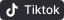
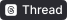

<div align="center">
  

  # OmniFlow

  **Ứng dụng tải video, âm thanh & ảnh đa nền tảng cho macOS.**

  Dán link. Nhận file. Không watermark, không quảng cáo, không bị chặn bởi anti-bot.

  [](LICENSE)
  [](#cài-đặt)
  [](../../releases/latest)

  **[🇬🇧 English](README.md)&nbsp;&nbsp;|&nbsp;&nbsp;🇻🇳 Tiếng Việt**
</div>

---

## Tải xuống

Không chắc máy Mac của bạn dùng chip gì? Menu Apple (góc trên bên trái) → **Giới thiệu về máy
Mac này** (About This Mac).

<p align="center">
  <a href="https://github.com/quangdng95/OmniFlow/releases/latest/download/OmniFlow-AppleSilicon.dmg"></a>
  <a href="https://github.com/quangdng95/OmniFlow/releases/latest/download/OmniFlow-Intel.dmg"></a>
</p>

Hai link trên luôn trỏ tới bản phát hành mới nhất. Xem [Cài đặt](#cài-đặt) bên dưới để biết việc
cần làm sau khi tải — bao gồm các cảnh báo bảo mật macOS xuất hiện một lần khi mở app lần đầu.

---

## Ứng dụng làm được gì

OmniFlow trích xuất và tải video, âm thanh, ảnh chất lượng cao, không watermark từ những nền tảng
mà các nhà sáng tạo, designer, và nhà nghiên cứu thực sự lấy tư liệu tham khảo:

<p align="center">
  
  
  
  
  
  
  
  
</p>

**YouTube · TikTok · Instagram · Facebook · RedNote (Xiaohongshu) · LinkedIn · Threads · X (Twitter)**

| Nền tảng | Từng item | Hàng loạt / nhiều item | Ghi chú |
|---|---|---|---|
| YouTube | ✅ Video, chỉ âm thanh | ✅ Playlist, kênh, Mix/Radio | |
| TikTok | ✅ Video, slideshow Photo Mode | — | |
| Instagram | ✅ Post, Reel, ảnh | ✅ Carousel, Story, profile/Reels | Nội dung riêng tư cần đăng nhập trên trình duyệt |
| Facebook | ✅ Reel | — | |
| RedNote (Xiaohongshu) | ✅ Video, ảnh | — | |
| LinkedIn | ✅ Bài video, bài ảnh | — | Bài dạng tài liệu/slide chưa hỗ trợ |
| Threads | ✅ Bài video, bài ảnh | — | Cần đăng nhập trên trình duyệt |
| X (Twitter) | ✅ Bài video | — | |

## Tính năng

- **Tải đơn hoặc hàng loạt** — một video, hay cả playlist/kênh YouTube, carousel Instagram, hoặc
  Story Instagram, chỉ trong một lần dán link.
- **Tự động nhận diện link** — OmniFlow tự xác định link là một item đơn hay nguồn nhiều item;
  bạn không cần khai báo gì cả.
- **Điều khiển từng item** — trong playlist hay carousel, tải hết một lượt, chọn riêng từng cái,
  hoặc thử lại một item bị lỗi.
- **Chất lượng thật, không mất thời gian re-encode** — xuất file H.264/AAC MP4 phát được ngay
  trong QuickLook và QuickTime, tải song song nhiều fragment và merge kiểu stream-copy (không
  transcode toàn bộ) nên xuất file rất nhanh.
- **Theo dõi tiến trình trực tiếp** — tiến trình tải từng item và tổng thể, có thể hủy bất cứ lúc
  nào.
- **Chạy hoàn toàn trên máy bạn** — không có server trung tâm, không upload link hay cookie của
  bạn đi bất cứ đâu.

## Cài đặt

1. Tải file `.dmg` đúng với chip máy Mac của bạn — xem [Tải xuống](#tải-xuống) ở trên, hoặc lấy
   từ [Releases](../../releases/latest):
   - **OmniFlow-AppleSilicon.dmg** — cho Mac M1/M2/M3/M4
   - **OmniFlow-Intel.dmg** — cho Mac dùng chip Intel
2. Mở file `.dmg` và kéo **OmniFlow** vào thư mục `Applications`.
3. Lần đầu mở app, macOS sẽ hiện một hoặc hai cảnh báo bảo mật (cảnh báo "nhà phát triển không
   xác định", và — chỉ khi bạn định tải nội dung riêng tư từ Instagram/Threads — yêu cầu quyền
   truy cập Keychain). Cả hai đều bình thường, chỉ xuất hiện một lần, và được giải thích từng bước
   trong [Cảnh báo bảo mật macOS khi mở app lần đầu](docs/FIRST_LAUNCH.vi.md).

Muốn tự build app? Xem [Build từ mã nguồn](#build-từ-mã-nguồn) bên dưới.

## Cách dùng

1. Dán link vào OmniFlow (từ clipboard, hoặc gõ/dán thủ công).
2. OmniFlow tự nhận diện nền tảng và xác định đây là một item đơn hay một danh sách.
3. Chọn chất lượng (Best, 1080p, 720p, 480p, Chỉ âm thanh, …) — hoặc, nếu là danh sách, chọn
   những item bạn muốn.
4. Bấm **Download** và theo dõi tiến trình theo thời gian thực.
5. File hoàn tất sẽ nằm trong thư mục tải đã cấu hình (mặc định là `~/Downloads`).

Một số nền tảng (Instagram, Threads) cần một phiên đăng nhập trên trình duyệt để lấy được nội
dung riêng tư/bị giới hạn — OmniFlow tự đọc thông tin này từ cookie trình duyệt trên máy bạn;
không cần export thủ công.

**Ví dụ:**

```
Dán:    https://www.youtube.com/watch?v=dQw4w9WgXcQ
Chọn:   Best
Nhận:   Never Gonna Give You Up.mp4  (trong ~/Downloads)
```

Chưa biết thử link nào trước? [**Link ví dụ**](docs/EXAMPLE_LINKS.vi.md) có sẵn một link mẫu
dán-là-chạy cho mỗi nền tảng được hỗ trợ.

## Build từ mã nguồn

**Yêu cầu:** Node.js, Python 3.9+, npm.

```bash
# clone và vào thư mục repo
git clone https://github.com/quangdng95/OmniFlow.git
cd OmniFlow

# cài đặt một lần
python3 -m venv .venv && source .venv/bin/activate
pip install -r requirements.txt
cd frontend && npm install && cd ..
```

**Chạy ở chế độ dev** (hot-reload, backend Flask trên `:5001` + frontend Vite trên `:5173`):

```bash
./scripts/dev.sh
```

**Build app macOS độc lập** (tạo ra `dist/OmniFlow.app` và `dist/OmniFlow.dmg`):

```bash
./scripts/build.sh
```

## Tech stack

- **Backend:** Python, Flask, [`yt-dlp`](https://github.com/yt-dlp/yt-dlp) (gọi trực tiếp
  in-process), `ffmpeg` được đóng gói sẵn để remux.
- **Frontend:** React 19, TypeScript, Vite, Tailwind CSS, [shadcn/ui](https://ui.shadcn.com).
- **Desktop shell:** [`pywebview`](https://pywebview.flowrl.com), đóng gói bằng PyInstaller.

## Quyền riêng tư

OmniFlow chạy hoàn toàn trên máy Mac của bạn. Ứng dụng **không**:

- Lưu trữ hay chuyển tiếp file tải qua bất kỳ server bên ngoài nào
- Theo dõi hay ghi log lịch sử tải của bạn
- Thu thập hay truyền đi bất kỳ dữ liệu cá nhân nào

Cookie trình duyệt (dùng để lấy nội dung riêng tư từ Instagram/Threads) được đọc cục bộ trên máy
bạn và không bao giờ rời khỏi máy.

## Roadmap

Những gap còn tồn đọng, được ghi nhận trung thực thay vì giấu đi.

**Hoàn thiện app macOS**

- [x] `ffmpeg` native `arm64` cho bản Apple Silicon, không còn cần Rosetta 2 lúc chạy (cả bản
  Apple Silicon lẫn Intel giờ đều dùng binary native cho đúng chip của mình)
- [ ] Code signing + notarization, để macOS không còn cảnh báo "nhà phát triển không xác định"
  khi mở lần đầu — cần một tài khoản Apple Developer trả phí; xem [First Launch](docs/FIRST_LAUNCH.vi.md)
  để biết cách xử lý tạm thời (miễn phí, chỉ làm một lần) trong lúc chờ
- [ ] Hỗ trợ bài đăng LinkedIn dạng tài liệu/slide (PDF) — vẫn chưa có cách trích xuất nào (cần
  một link ví dụ thật để reverse-engineer), nhưng app giờ báo rõ ràng khi link thuộc dạng bài đăng
  chưa hỗ trợ này thay vì báo lỗi chung chung
- [ ] Build cho Windows / Linux

**Mở rộng nền tảng**

- [ ] Chrome extension — bấm một nút ngay trên trình duyệt để gửi video đang xem thẳng vào
  OmniFlow, không cần copy-paste link
- [ ] Một cách tiện lợi để gửi link vào OmniFlow từ điện thoại trong khi app đang chạy trên máy
  Mac (ví dụ: một iOS Shortcut, hoặc một trang web tối ưu cho di động)
- [ ] App Android native
- [ ] App iOS native

> **Về 2 mục app di động native ở trên:** đây vẫn là ý tưởng sớm, mang tính khám phá, chưa cam
> kết thực hiện. `yt-dlp` là một công cụ Python, và toàn bộ thiết kế của dự án này chủ đích tránh
> dùng server trung tâm (xem [Disclaimer](.github/DISCLAIMER.md)) nên mỗi lượt tải chạy cục bộ,
> trên chính máy của người dùng — ràng buộc đó không biến mất chỉ vì thiết bị là điện thoại. Cả
> App Store lẫn Play Store đều có lịch sử rõ ràng về việc từ chối hoặc gỡ bỏ các app "tải video"
> vì lo ngại bản quyền/ToS, nên một app di động native có thể sẽ phải phân phối ngoài store chính
> thức (sideloading, kiểu phân phối như TestFlight) thay vì mặc định có sẵn trên store thông
> thường.

## Xử lý sự cố

Gặp cảnh báo bảo mật khi mở lần đầu, hay việc check/tải cứ lỗi hoài? Hai hướng dẫn dưới đây giải
thích chi tiết, từng bước:

- **[Cảnh báo bảo mật macOS khi mở app lần đầu](docs/FIRST_LAUNCH.vi.md)** — cảnh báo "nhà phát
  triển không xác định" và yêu cầu quyền Keychain bạn có thể gặp lần đầu mở app hoặc tải từ
  Instagram/Threads.
- **[Xử lý lỗi Check/Tải file](docs/TROUBLESHOOTING.vi.md)** — cần làm gì khi một link không check
  được hoặc tải cứ lỗi, bao gồm cách dùng công cụ **Diagnostic Logs** và **Reset App Data** có sẵn
  trong Settings.

Nếu vẫn không giải quyết được, xem [Hỗ trợ & Báo lỗi](#hỗ-trợ--báo-lỗi) bên dưới.

## Đóng góp

Rất hoan nghênh mọi đóng góp:

1. Fork repository
2. Tạo một branch mới (`git checkout -b feat/my-feature`)
3. Commit thay đổi của bạn
4. Push lên branch và mở một Pull Request

## Hỗ trợ & Báo lỗi

Vẫn bị kẹt sau khi đã xem hướng dẫn [Xử lý sự cố](#xử-lý-sự-cố) ở trên? Mở một issue trên
[GitHub Issues](https://github.com/quangdng95/OmniFlow/issues) — kèm theo:

- Link bạn đang cố tải (nếu không phải nội dung riêng tư/nhạy cảm)
- Chip máy Mac của bạn (Apple Silicon hay Intel) và phiên bản macOS
- Nội dung file `errors.log`, nếu có — Settings → **Diagnostic Logs** → **Open Log Folder**

Có ý tưởng tính năng mới? Cũng mở issue để đề xuất nhé.

## Disclaimer

OmniFlow được xây dựng cho **mục đích cá nhân, phi thương mại** — nghiên cứu, học tập, và lưu trữ
tư liệu tham khảo của riêng bạn. Bạn tự chịu trách nhiệm về vấn đề bản quyền của bất kỳ nội dung
nào bạn tải xuống, và về việc tuân thủ Điều khoản Dịch vụ của từng nền tảng. Nhóm phát triển cung
cấp công cụ này "NGUYÊN TRẠNG" (AS IS), không chịu trách nhiệm pháp lý cho cách nó được sử dụng —
xem [DISCLAIMER.md](.github/DISCLAIMER.md) để đọc toàn bộ tuyên bố miễn trừ trách nhiệm và
[CODE_OF_CONDUCT.md](.github/CODE_OF_CONDUCT.md) để biết chính sách sử dụng được chấp nhận.

## Giấy phép

Phát hành theo giấy phép [GNU General Public License v3.0](LICENSE).
